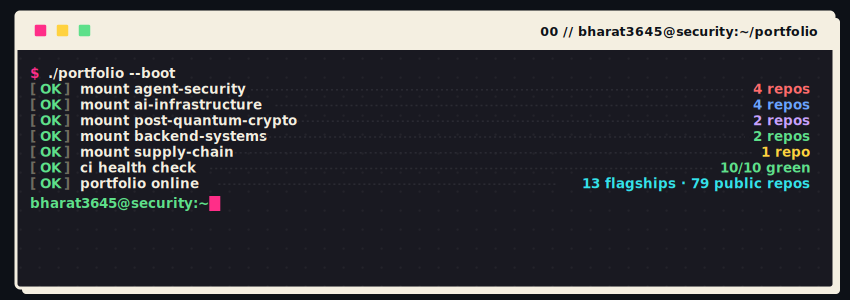
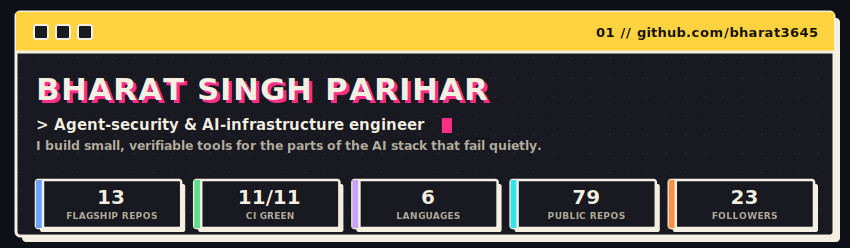
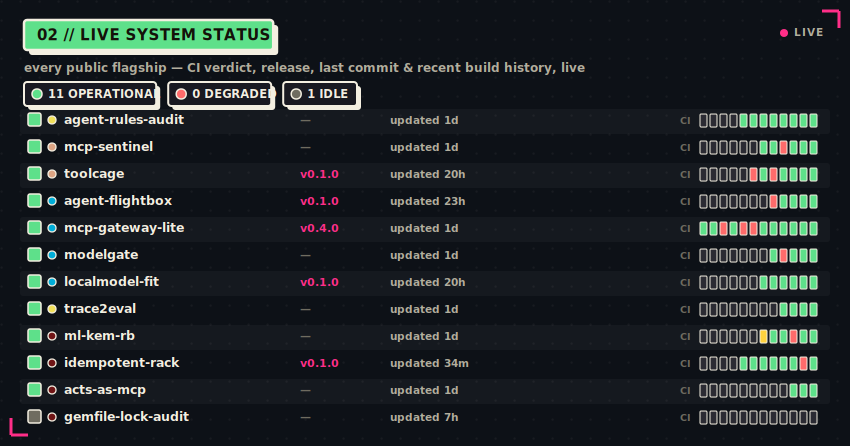
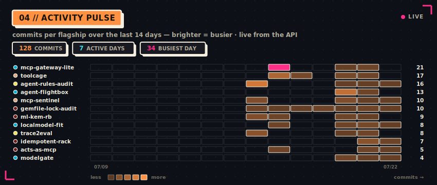
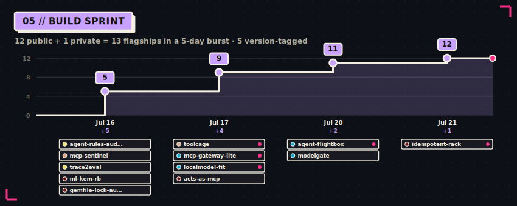
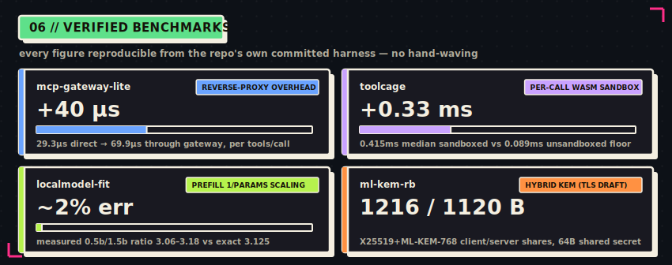
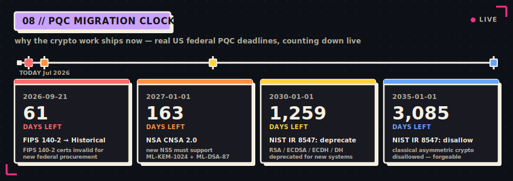
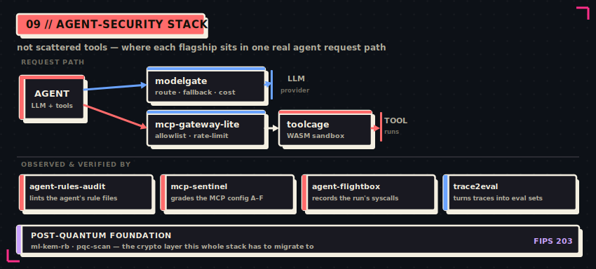

<!--
  Profile README — self-hosted live dashboard.
  Every visual below is a custom SVG generated from live GitHub API data by
  assets/generate.py and committed to this repo (assets/*.svg), refreshed daily
  by .github/workflows/profile-assets.yml. Nothing here depends on a third-party
  image host at view time. Every number is real and reproducible. Dark/light
  variants are served via <picture>. Motion is SMIL (served verbatim by GitHub);
  every animation is additive and degrades to a complete static frame.
-->

<div align="center">

<picture>
  <source media="(prefers-color-scheme: dark)"  srcset="./assets/boot-dark.svg">
  <source media="(prefers-color-scheme: light)" srcset="./assets/boot-light.svg">
  
</picture>

<picture>
  <source media="(prefers-color-scheme: dark)"  srcset="./assets/hero-dark.svg">
  <source media="(prefers-color-scheme: light)" srcset="./assets/hero-light.svg">
  
</picture>

</div>

## ▌ WHOAMI

I build **small, verifiable tools for the parts of the AI stack that fail quietly** — agent sandboxes, MCP gateways, model-fit predictors, and post-quantum crypto. Each of the 13 flagship repos below ships with a real test suite, CI, and — where it makes a claim about speed or correctness — a committed benchmark you can re-run yourself.

- 🔭 **Now:** hardening the flagship portfolio for launch · `pqc-scan` in private beta ahead of the **Sept 2026** FIPS 140-2 sunset
- 🧭 **Focus:** agent security · AI infrastructure · post-quantum readiness · backend systems
- 🧪 **How I work:** reference-validated implementations, adversarial tests, reproducible benchmarks — no unverified claims
- 💬 **Ask me about:** MCP security & sandboxing · LLM gateways · PQC migration · idempotent backends
- 📫 **Reach me:** [LinkedIn](https://linkedin.com/in/bharat-singh-parihar) · [Portfolio](https://bharat3645.vercel.app) · [Email](mailto:404ghost.2@gmail.com)

---

## ▌ LIVE SYSTEM STATUS

<div align="center">

<picture>
  <source media="(prefers-color-scheme: dark)"  srcset="./assets/status-dark.svg">
  <source media="(prefers-color-scheme: light)" srcset="./assets/status-light.svg">
  
</picture>

</div>

> The board above is regenerated daily from the live GitHub API — CI dots, uptime bars, versions and "last commit" ages are real. When a flagship's build is red, it says so.

---

## ▌ PORTFOLIO MAP

<div align="center">

<picture>
  <source media="(prefers-color-scheme: dark)"  srcset="./assets/domains-dark.svg">
  <source media="(prefers-color-scheme: light)" srcset="./assets/domains-light.svg">
  
</picture>

</div>

### 🛡️ Agent Security

| Repo | Stack | Release | What it does |
|------|-------|:-------:|--------------|
| **[agent-rules-audit](https://github.com/bharat3645/agent-rules-audit)** | JavaScript | — | Static linter for AI-agent rule files (Cursor / Claude / Copilot) — flags over-broad tool grants and injection-prone instructions. |
| **[mcp-sentinel](https://github.com/bharat3645/mcp-sentinel)** | Rust | — | Offline risk scanner for MCP client configs — grades each server **A–F** on inline secrets, `@latest` pins, shell indirection, typosquats. |
| **[toolcage](https://github.com/bharat3645/toolcage)** | Rust | `v0.1.0` | WASM sandbox for MCP tool calls — a fresh `wasmtime` Store per call, deny-by-default caps, HMAC-signed `tools/list` pagination. |
| **[agent-flightbox](https://github.com/bharat3645/agent-flightbox)** | Go | `v0.1.0` | Flight recorder for agent processes — captures the syscall / exec / network surface of a run to tamper-evident JSONL, with a session `diff`. |

### 🧠 AI Infrastructure

| Repo | Stack | Release | What it does |
|------|-------|:-------:|--------------|
| **[mcp-gateway-lite](https://github.com/bharat3645/mcp-gateway-lite)** | Go | `v0.4.0` | Single-binary reverse proxy for MCP — allowlist filtering, rate limiting, tamper-evident audit log, `tools_lock` against rug-pulls. |
| **[modelgate](https://github.com/bharat3645/modelgate)** | Go | — | Multi-provider LLM gateway — routing, automatic fallback, token/cost accounting, metadata-only audit trail. stdlib-only. |
| **[localmodel-fit](https://github.com/bharat3645/localmodel-fit)** | Go | `v0.1.0` | Predicts whether a GGUF model fits and how fast it decodes on given hardware — MoE-aware, validated against real `ollama` runs. |
| **[trace2eval](https://github.com/bharat3645/trace2eval)** | JavaScript | — | Turns raw agent traces into scrubbed, deduplicated eval datasets — PII scrub *before* dedupe, deterministic, offline. |

### 🔐 Post-Quantum Crypto

| Repo | Stack | Release | What it does |
|------|-------|:-------:|--------------|
| **[ml-kem-rb](https://github.com/bharat3645/ml-kem-rb)** | Ruby | — | Reference **ML-KEM (FIPS 203)** in pure Ruby, plus a real **hybrid X25519 + ML-KEM-768** KEM implementing the TLS 1.3 draft wire format. |
| **pqc-scan** `🔒 private` | Rust | — | Crypto inventory → CycloneDX **CBOM** → A–F post-quantum readiness grade, with live TLS 1.3 handshake checks. Launches **Sept 2026**. |

### 🗄️ Backend Systems & Supply Chain

| Repo | Stack | Release | What it does |
|------|-------|:-------:|--------------|
| **[idempotent-rack](https://github.com/bharat3645/idempotent-rack)** | Ruby | `v0.1.0` | Idempotency-Key middleware for Rack/Rails — dedupes retried POST/PUT against a pluggable store. *(0.3.0 Redis/ActiveRecord backends in progress.)* |
| **[acts-as-mcp](https://github.com/bharat3645/acts-as-mcp)** | Ruby | — | Expose ActiveRecord models as MCP tools from a Rails app with one class macro — scoped, read-only-by-default agent access. |
| **[gemfile-lock-audit](https://github.com/bharat3645/gemfile-lock-audit)** | Ruby | — | Audits a `Gemfile.lock` for yanked gems, git-sourced deps, and pins that drift from the lockfile — zero network, CI-friendly. |

---

## ▌ ACTIVITY PULSE

<div align="center">

<picture>
  <source media="(prefers-color-scheme: dark)"  srcset="./assets/pulse-dark.svg">
  <source media="(prefers-color-scheme: light)" srcset="./assets/pulse-light.svg">
  
</picture>

</div>

## ▌ BUILD SPRINT

<div align="center">

<picture>
  <source media="(prefers-color-scheme: dark)"  srcset="./assets/timeline-dark.svg">
  <source media="(prefers-color-scheme: light)" srcset="./assets/timeline-light.svg">
  
</picture>

</div>

---

## ▌ VERIFIED BENCHMARKS

<div align="center">

<picture>
  <source media="(prefers-color-scheme: dark)"  srcset="./assets/benchmarks-dark.svg">
  <source media="(prefers-color-scheme: light)" srcset="./assets/benchmarks-light.svg">
  
</picture>

</div>

<details>
<summary><b>Reproduce these numbers yourself ▸</b></summary>

```sh
# mcp-gateway-lite — reverse-proxy overhead (Apple M4, go1.26.5)
go test -run '^$' -bench . -benchtime=2s ./gateway/...      # 29.3µs direct vs 69.9µs through gateway

# toolcage — per-call WASM sandbox overhead (ubuntu-latest CI, 200 echo calls)
python3 ci/bench.py WORK ./target/release/toolcage x.wasm 200   # 0.415ms median vs 0.089ms unsandboxed floor

# localmodel-fit — prefill 1/params scaling (Apple M4, real ollama)
go run ./bench -model qwen2.5:0.5b -hw m4 -params 494032768     # measured 0.5b/1.5b ratio 3.06–3.18 vs exact 3.125

# ml-kem-rb — hybrid X25519+ML-KEM-768, TLS draft wire format (FIPS 203)
ruby -rml_kem/hybrid -e 'p MLKem::Hybrid.client_init[0].bytesize'  # => 1216 (server share 1120, shared secret 64 B)
```
</details>

---

## ▌ POST-QUANTUM MIGRATION CLOCK

Two of my repos (`ml-kem-rb`, `pqc-scan`) exist because the crypto deadlines below are real and close. The clock counts down live against these US federal dates (NIST / NSA primary sources).

<div align="center">

<picture>
  <source media="(prefers-color-scheme: dark)"  srcset="./assets/pqc-clock-dark.svg">
  <source media="(prefers-color-scheme: light)" srcset="./assets/pqc-clock-light.svg">
  
</picture>

</div>

---

## ▌ LANGUAGE MIX

<div align="center">

<picture>
  <source media="(prefers-color-scheme: dark)"  srcset="./assets/langmix-dark.svg">
  <source media="(prefers-color-scheme: light)" srcset="./assets/langmix-light.svg">
  
</picture>

</div>

---

## ▌ AGENT-SECURITY STACK

<div align="center">

<picture>
  <source media="(prefers-color-scheme: dark)"  srcset="./assets/stack-dark.svg">
  <source media="(prefers-color-scheme: light)" srcset="./assets/stack-light.svg">
  
</picture>

</div>

> These aren't scattered side-projects. `modelgate` gates the LLM calls; `mcp-gateway-lite` filters the tool calls; `toolcage` sandboxes each one; `mcp-sentinel`, `agent-rules-audit`, `agent-flightbox` and `trace2eval` watch the run — and `ml-kem-rb` / `pqc-scan` are the post-quantum floor the whole thing has to stand on.

---

## ▌ CONTRIBUTION GRAPH

<div align="center">

<picture>
  <source media="(prefers-color-scheme: dark)"  srcset="https://raw.githubusercontent.com/bharat3645/bharat3645/output/github-contribution-grid-snake-dark.svg">
  <source media="(prefers-color-scheme: light)" srcset="https://raw.githubusercontent.com/bharat3645/bharat3645/output/github-contribution-grid-snake.svg">
  
</picture>

</div>

---

<div align="center">

```
── EOF ────────────────────────────────────────────────────────────
   if a tool makes a claim, it ships with the test that proves it.
────────────────────────────────────────────────────────────────────
```

**This whole page is a program.** Nine custom SVG instruments, built from live GitHub data by [`assets/generate.py`](./assets/generate.py), committed to this repo, and refreshed every day by a [GitHub Action](./.github/workflows/profile-assets.yml). No third-party widget services. No mocked numbers. Every figure is real and reproducible — down to the red build I haven't hidden.

<sub>◆ self-hosted ◆ live-sourced ◆ dark/light aware ◆ animated in-SVG ◆ zero external widgets</sub>

</div>
