<!--
  Profile README — self-hosted live dashboard.
  Every visual below is a custom SVG generated from live GitHub API data by
  assets/generate.py and committed to this repo (assets/*.svg), refreshed daily
  by .github/workflows/profile-assets.yml. Nothing here depends on a third-party
  image host at view time. Every number is real and reproducible. Dark/light
  variants are served via <picture>. Motion is SMIL (served verbatim by GitHub);
  every animation is additive and degrades to a complete static frame.
-->

<div align="center">

<picture>
  <source media="(prefers-color-scheme: dark)"  srcset="./assets/boot-dark.svg">
  <source media="(prefers-color-scheme: light)" srcset="./assets/boot-light.svg">
  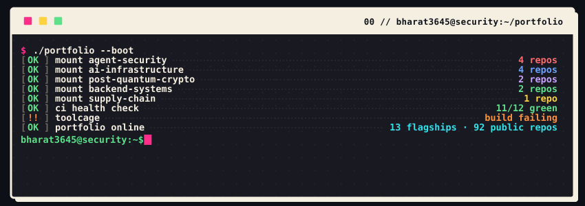
</picture>

<picture>
  <source media="(prefers-color-scheme: dark)"  srcset="./assets/hero-dark.svg">
  <source media="(prefers-color-scheme: light)" srcset="./assets/hero-light.svg">
  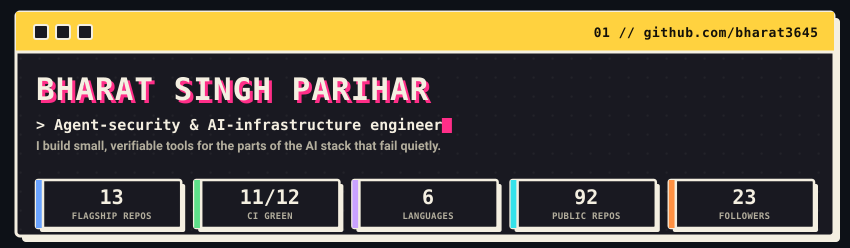
</picture>

</div>

## ▌ WHOAMI

I build **small, verifiable tools for the parts of the AI stack that fail quietly** — agent sandboxes, MCP gateways, model-fit predictors, and post-quantum crypto. Each of the flagship repos below ships with a real test suite, CI, and — where it makes a claim about speed or correctness — a committed benchmark you can re-run yourself.

That's the current chapter. The arc behind it runs from C data structures in 2023, through computer-vision research and a stretch of hackathons and Web3 builds, into GenAI platforms, and now into infrastructure and security. The whole path is below, not just the recent sprint.

- 💼 **Now:** CTO @ a stealth AI startup (clinical AI) · AI Engineer @ **Nextent Labs** — groundwater & environmental intelligence for government water departments
- 🛠️ **Recently:** AI/ML @ **RnR Consulting** (Delhi) — shipped a model-routing harness that cut inference cost **58% / 65%**; Go microservices in a 29-service, Temporal-orchestrated backend serving 500+ concurrent users
- 🎓 **Research:** **1 Springer Q1 journal · 3 IEEE / SCOPUS papers · 2 book chapters** — deepfake detection, federated learning, PQC (see the Research & Impact panel below)
- 🧭 **Focus:** agent security · AI infrastructure · post-quantum readiness · backend systems
- 🧪 **How I work:** reference-validated implementations, adversarial tests, reproducible benchmarks — no unverified claims
- 🎓 **B.Tech (Hons.) CS**, Data Science — Symbiosis Institute of Technology, Nagpur (2022–26)
- 📫 **Reach me:** [LinkedIn](https://linkedin.com/in/bharat-singh-parihar) · [Portfolio](https://bharat3645.vercel.app) · [Email](mailto:404ghost.2@gmail.com)

---

## ▌ LIVE SYSTEM STATUS

<div align="center">

<picture>
  <source media="(prefers-color-scheme: dark)"  srcset="./assets/status-dark.svg">
  <source media="(prefers-color-scheme: light)" srcset="./assets/status-light.svg">
  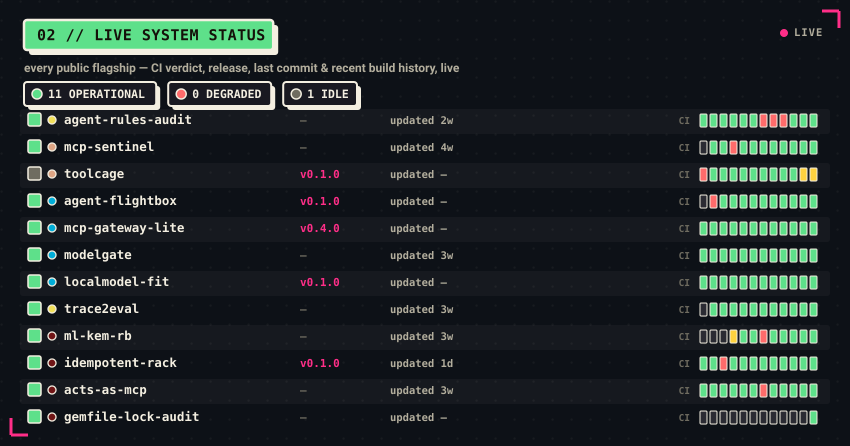
</picture>

</div>

> The board above is regenerated daily from the live GitHub API — CI dots, uptime bars, versions and "last commit" ages are real. When a flagship's build is red, it says so.

---

## ▌ PORTFOLIO MAP

<div align="center">

<picture>
  <source media="(prefers-color-scheme: dark)"  srcset="./assets/domains-dark.svg">
  <source media="(prefers-color-scheme: light)" srcset="./assets/domains-light.svg">
  
</picture>

</div>

### 🛡️ Agent Security

| Repo | Stack | Release | What it does |
|------|-------|:-------:|--------------|
| **[The-Ideal-Harness](https://github.com/bharat3645/The-Ideal-Harness)** | TypeScript | — | The control-plane OS around a stateless model. A deny-wins, fail-closed policy floor on `PreToolUse`/`PostToolUse` hooks — enforcement below the model, not a paragraph in a prompt — plus secret redaction, injection fencing, skill vetting, a hash-chained audit journal, code-graph memory and cache-safe tool-result compression. Six modules, 329 tests, **zero runtime dependencies**. Contributors welcome — see the `good first issue` label. |
| **[agent-rules-audit](https://github.com/bharat3645/agent-rules-audit)** | JavaScript | — | Static linter for AI-agent rule files (Cursor / Claude / Copilot) — flags over-broad tool grants and injection-prone instructions. |
| **[mcp-sentinel](https://github.com/bharat3645/mcp-sentinel)** | Rust | — | Offline risk scanner for MCP client configs — grades each server **A–F** on inline secrets, `@latest` pins, shell indirection, typosquats. |
| **[toolcage](https://github.com/bharat3645/toolcage)** | Rust | `v0.1.0` | Per-tool-call WASM sandbox for MCP servers — every `tools/call` runs in a fresh `wasmtime` instance with only the filesystem that tool's policy grants. |
| **[agent-flightbox](https://github.com/bharat3645/agent-flightbox)** | Go | `v0.1.0` | Flight recorder for agent processes — captures the syscall / exec / network surface of a run to tamper-evident JSONL, with a session `diff`. |

### 🧠 AI Infrastructure

| Repo | Stack | Release | What it does |
|------|-------|:-------:|--------------|
| **[mcp-gateway-lite](https://github.com/bharat3645/mcp-gateway-lite)** | Go | `v0.4.0` | Single-binary reverse proxy for MCP — allowlist filtering, rate limiting, tamper-evident audit log, `tools_lock` against rug-pulls. |
| **[modelgate](https://github.com/bharat3645/modelgate)** | Go | — | Multi-provider LLM gateway — routing, automatic fallback, token/cost accounting, metadata-only audit trail. stdlib-only. |
| **[localmodel-fit](https://github.com/bharat3645/localmodel-fit)** | Go | `v0.1.0` | Memory-bandwidth-aware local-LLM advisor — predicted decode tok/s, the best quant that fits, speculative-decoding hints. Published methodology, validated against real `ollama` runs. |
| **[trace2eval](https://github.com/bharat3645/trace2eval)** | JavaScript | — | Turns raw agent traces into scrubbed, deduplicated eval datasets — PII scrub *before* dedupe, deterministic, offline. |

### 🔌 MCP Ecosystem

| Repo | Stack | What it does |
|------|-------|--------------|
| **[voraxx-mcp-server](https://github.com/bharat3645/voraxx-mcp-server)** | Python | Stdlib-only MCP server with three security tools — CVE lookup via OSV.dev, host exposure via Shodan InternetDB, and orchestration of a locally installed Nuclei scanner. No exploit code bundled; 19 tests. |
| **[mcp-registry-finder](https://github.com/bharat3645/mcp-registry-finder)** | JavaScript | Zero-dependency MCP server for searching the official registry — find servers by keyword, inspect details, get install snippets. `node:test` suite with recorded fixtures. |
| **[acts-as-mcp](https://github.com/bharat3645/acts-as-mcp)** | Ruby | Expose a Rails app as a policy-aware, read-only MCP server — explicit attribute exposure, per-call authorization, audit events. Zero runtime dependencies. |

### 🔐 Post-Quantum Crypto

| Repo | Stack | Release | What it does |
|------|-------|:-------:|--------------|
| **[ml-kem-rb](https://github.com/bharat3645/ml-kem-rb)** | Ruby | — | Reference **ML-KEM (FIPS 203)** in pure Ruby, plus a real **hybrid X25519 + ML-KEM-768** KEM implementing the TLS 1.3 draft wire format. |
| **pqc-scan** `🔒 private` | Rust | — | Crypto inventory → CycloneDX **CBOM** → A–F post-quantum readiness grade, with live TLS 1.3 handshake checks. Launches **Sept 2026**. |

### 🧰 Developer Tooling & Responsible ML

Small, single-purpose CLIs. Each one exists because a specific check was missing, not because a category needed filling.

| Repo | Stack | What it does |
|------|-------|--------------|
| **[biasscope](https://github.com/bharat3645/biasscope)** | Python | ML fairness report cards — demographic parity, equal opportunity, disparate impact, computed directly in pandas/numpy, graded A–F and explained in plain English. |
| **[a11y-agent](https://github.com/bharat3645/a11y-agent)** | Python | Context-aware accessibility scanner — catches the semantic a11y smells (generic alt text, vague link text, colour-only meaning, heading skips) that axe-core and `eslint-plugin-jsx-a11y` miss. |
| **[shiftsense](https://github.com/bharat3645/shiftsense)** | Python | Incident postmortem auto-drafting — parses a raw timeline into phases, extracts action items, assembles a blameless-postmortem scaffold. |
| **[moodmesh](https://github.com/bharat3645/moodmesh)** | Python | Engineering-team burnout early warning from git and PR metadata — trend-based, ethics-first, manager-only by design. |
| **[FrameSage](https://github.com/bharat3645/FrameSage)** | Python | Tool-calling EDA agent for pandas — an offline heuristic planner drives 9 dataframe tools to profile CSVs into Markdown reports. 34 tests, LLM planner optional. |
| **[gemfile-lock-audit](https://github.com/bharat3645/gemfile-lock-audit)** | Ruby | Offline A–F supply-chain risk scanner for `Gemfile.lock` — zero dependencies, zero network calls. |
| **[VeriNet](https://github.com/bharat3645/VeriNet)** | Python | SHA-256 checksum manifests for a directory tree, verified later to detect modified, missing or new files. |

### 🗄️ Backend Systems

| Repo | Stack | Release | What it does |
|------|-------|:-------:|--------------|
| **[idempotent-rack](https://github.com/bharat3645/idempotent-rack)** | Ruby | `v0.1.0` | Idempotency-Key middleware for Rack/Rails — dedupes retried POST/PUT against a pluggable store. *(0.3.0 Redis/ActiveRecord backends in progress.)* |
| **[prism-infranest](https://github.com/bharat3645/prism-infranest)** | Python | — | AI backend-generation platform — natural-language prompt → clarifying questions → YAML DSL → production-ready Django, Go Fiber or Rails project with Docker, tests and docs. |
| **[compliance-manager](https://github.com/bharat3645/compliance-manager)** | Go | — | Desktop PII/compliance scanner (Go + Wails) — extracts document text, matches rule definitions, scores risk, browses results as a file hierarchy. Optional Python ML validation and OCR. |
| **[DAG-Pipeline](https://github.com/bharat3645/DAG-Pipeline)** | JavaScript | — | Visual node-based pipeline builder (React Flow) with a FastAPI backend that validates the graph as cycle-free using Kahn's algorithm. |

---

## ▌ THE ARC — 2023 to now

The flagships above are the current chapter. This is how it got there. Each row is a real repo, and the honest caveats each one carries in its own README are carried through here too.

### 2023 — foundations

| Repo | What it is |
|------|------------|
| **[FDS](https://github.com/bharat3645/FDS)** | Fundamentals of Data Structures in **C** — stack-via-two-queues, valid parentheses, Dutch National Flag partitioning. The earliest thing on this account. |

### 2024 — research and first tools

| Repo | What it is |
|------|------------|
| **[Real-and-fake-face-distinction](https://github.com/bharat3645/Real-and-fake-face-distinction)** | Keras CNN classifying real vs AI-generated faces — the research behind the **SCOPUS-indexed IEEE deepfake-detection paper** (93.5% accuracy). |
| **[pbl](https://github.com/bharat3645/pbl)** | Deep-learning **image encryption** — DCGAN key generator + attention/residual CNN, with NPCR/UACI security analysis. |
| **[hackathon](https://github.com/bharat3645/hackathon)** | A CLI that scaffolds a hackathon project skeleton in seconds. First tool I built because the friction annoyed me — the same instinct behind everything in the tooling section above. |
| **[shadcn-dashboard](https://github.com/bharat3645/shadcn-dashboard)** | Next.js 15 + shadcn/ui admin template. Mock data, no backend — a UI study, labelled as one. |

### 2025 — building broadly

Computer vision, accessibility, Web3, and a lot of shipping.

| Repo | What it is |
|------|------------|
| **[HandTalk](https://github.com/bharat3645/HandTalk)** | Real-time ASL sign recognition in video calls — React client, Node/WebRTC signalling, Flask ML backend with MediaPipe + a fine-tuned MobileNet. Team project. |
| **[NeuroOCR](https://github.com/bharat3645/NeuroOCR)** | Offline handwriting OCR — custom-trained TensorFlow.js CNN, fully client-side inference. No server, no uploads. |
| **[DreamCanvas](https://github.com/bharat3645/DreamCanvas)** | Webcam drawing canvas controlled by hand gestures — point to draw, four fingers to erase. Flask + OpenCV + MediaPipe. |
| **[Task-Tokenizer](https://github.com/bharat3645/Task-Tokenizer)** | Web3 gig platform on Ethereum — Identity, Job, Reputation and Escrow contracts via Hardhat, Next.js frontend. Wallet connect works; homepage listings are demo data. |
| **[GigX](https://github.com/bharat3645/GigX)** | The decentralized gig marketplace variant — **3rd place, BITS Pilani Web3.0 '25**. |
| **[GlobalGive](https://github.com/bharat3645/GlobalGive)** | Blockchain crowdfunding — Solidity contracts plus frontend, transparent low-fee fundraising. |
| **[ChainFusion](https://github.com/bharat3645/ChainFusion)** | AI agents bridging Web2 apps to Web3 — LangChain/LangGraph routes with Hardhat tooling. |
| **[Quorix](https://github.com/bharat3645/Quorix)** | Local-first agentic-UI reference app — intent routing over 7 pure-TypeScript tools, word-by-word streaming, no backend. |
| **[NomadAI](https://github.com/bharat3645/NomadAI)** | Telegram voice-bot travel companion — Whisper transcribes, Groq Llama-3 detects language and vibe, Maps finds spots, gTTS answers in voice. |
| **[Mentoro](https://github.com/bharat3645/Mentoro)** | Emotion-adaptive gamified learning buddy — Remix + Go + Postgres monorepo. Prototype; most endpoints are mock data, stated plainly in its README. |
| **[medical-insurance-cost-prediction](https://github.com/bharat3645/medical-insurance-cost-prediction)** | R pipeline — EDA, linear/Ridge/Lasso and random forest, plus a Shiny app. |
| **[GenAI-Platform](https://github.com/bharat3645/GenAI-Platform)** | GenAI workspace: multi-PDF RAG chat, **GraphRAG** entity graphs, ATS resume feedback, text-to-SQL. Later iteration: **[genai-platform-v2](https://github.com/bharat3645/genai-platform-v2)** with a Kubernetes path. |

### 2026 — infrastructure, security, and applied CV

Everything in the flagship tables above, plus:

| Repo | What it is |
|------|------------|
| **[firesat-ai](https://github.com/bharat3645/firesat-ai)** | Hybrid CNN-LSTM + attention wildfire risk forecasting for Alaska — Sentinel-1/2, Landsat, MODIS, ERA5. The geospatial thread that connects to my current environmental-intelligence work. |
| **[fire_detection](https://github.com/bharat3645/fire_detection)** | Fire detection from satellite/aerial imagery — Keras CNN with **Grad-CAM explainability**, exposed via Streamlit, FastAPI and CLI. |
| **[Image-Captioning](https://github.com/bharat3645/Image-Captioning)** | CNN encoder + LSTM decoder on MS COCO (PyTorch) — beam search, Gradio demo, Docker, CI. |
| **[opencv-object-detection-suite](https://github.com/bharat3645/opencv-object-detection-suite)** | MobileNet-SSD webcam script, Flask + YOLOv3 web app, and a YOLOv3 CLI. |
| **[ScribeLens](https://github.com/bharat3645/ScribeLens)** | Browser-based handwritten OCR with Tesseract.js — entirely client-side. |
| **[AnyBrush](https://github.com/bharat3645/AnyBrush)** | Multi-modal accessible AI-art studio — eye tracking, voice commands, single-switch control, freehand drawing. |
| **[Wisely](https://github.com/bharat3645/Wisely)** | Privacy-first desktop meeting assistant (Tauri: Rust + React) — local Whisper STT, screen OCR, LLM chat. GPL-3.0 fork with added interview-mode features; upstream credited. |
| **[liquidation-aggregator](https://github.com/bharat3645/liquidation-aggregator)** | Indian government/bank auction aggregator — scrapes liquidation notices, values lots, grades flip economics. |
| **[Automation-AI](https://github.com/bharat3645/Automation-AI)** | Node-based workflow automation — FastAPI backend, natural-language-to-workflow generation, cron and webhook triggers. |

### 🤝 Client & freelance work

| Project | What it is |
|---------|------------|
| **[Sona-Sapphire](https://github.com/bharat3645/Sona-Sapphire)** | Cinematic agency site — Next.js 16, React 19, Tailwind 4, StringTune choreography. Local-SEO tuned with geo meta, JSON-LD `LocalBusiness`, sitemap; Resend inquiry form. |
| **adv-samit-siddhanta** `archived` | Single-page site for a Supreme Court advocate — **zero-dependency vanilla HTML/CSS/JS**, scroll reveals, parallax, BCI-compliant disclaimer. Client deliverable. |
| **[3D-Portfolio-Website](https://github.com/bharat3645/3D-Portfolio-Website)** | My own portfolio — Next.js 14, React Three Fiber / Spline, Framer Motion. Live at [bharat3645.vercel.app](https://bharat3645.vercel.app). |

---

## ▌ ACTIVITY PULSE

<div align="center">

<picture>
  <source media="(prefers-color-scheme: dark)"  srcset="./assets/pulse-dark.svg">
  <source media="(prefers-color-scheme: light)" srcset="./assets/pulse-light.svg">
  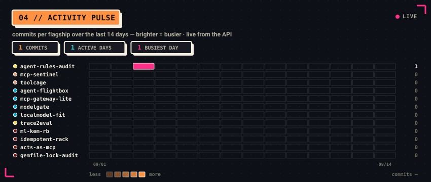
</picture>

</div>

## ▌ THE JOURNEY

<div align="center">

<picture>
  <source media="(prefers-color-scheme: dark)"  srcset="./assets/timeline-dark.svg">
  <source media="(prefers-color-scheme: light)" srcset="./assets/timeline-light.svg">
  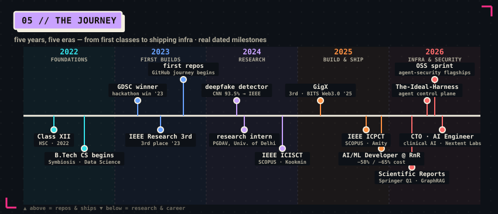
</picture>

</div>

---

## ▌ RESEARCH & IMPACT

<div align="center">

<picture>
  <source media="(prefers-color-scheme: dark)"  srcset="./assets/research-dark.svg">
  <source media="(prefers-color-scheme: light)" srcset="./assets/research-light.svg">
  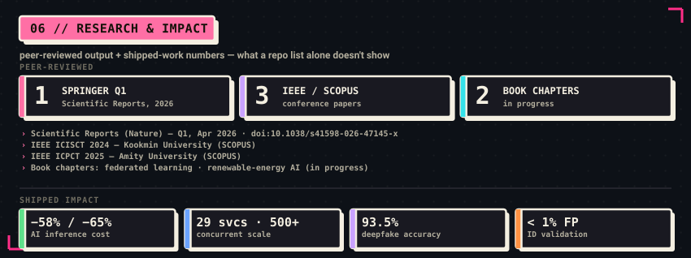
</picture>

</div>

> Peer-reviewed research is rare on a GitHub profile — **1 Springer Nature Q1 journal, 3 SCOPUS-indexed IEEE papers** (ICISCT '24 @ Kookmin University, ICPCT '25 @ Amity), and **2 book chapters** (federated learning; renewable-energy AI). The deepfake detector above fed one of those IEEE papers.

---

## ▌ VERIFIED BENCHMARKS

<div align="center">

<picture>
  <source media="(prefers-color-scheme: dark)"  srcset="./assets/benchmarks-dark.svg">
  <source media="(prefers-color-scheme: light)" srcset="./assets/benchmarks-light.svg">
  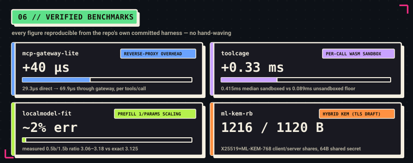
</picture>

</div>

<details>
<summary><b>Reproduce these numbers yourself ▸</b></summary>

```sh
# mcp-gateway-lite — reverse-proxy overhead (Apple M4, go1.26.5)
go test -run '^$' -bench . -benchtime=2s ./gateway/...      # 29.3µs direct vs 69.9µs through gateway

# toolcage — per-call WASM sandbox overhead (ubuntu-latest CI, 200 echo calls)
python3 ci/bench.py WORK ./target/release/toolcage x.wasm 200   # 0.415ms median vs 0.089ms unsandboxed floor

# localmodel-fit — prefill 1/params scaling (Apple M4, real ollama)
go run ./bench -model qwen2.5:0.5b -hw m4 -params 494032768     # measured 0.5b/1.5b ratio 3.06–3.18 vs exact 3.125

# ml-kem-rb — hybrid X25519+ML-KEM-768, TLS draft wire format (FIPS 203)
ruby -rml_kem/hybrid -e 'p MLKem::Hybrid.client_init[0].bytesize'  # => 1216 (server share 1120, shared secret 64 B)
```
</details>

---

## ▌ POST-QUANTUM MIGRATION CLOCK

Two of my repos (`ml-kem-rb`, `pqc-scan`) exist because the crypto deadlines below are real and close. The clock counts down live against these US federal dates (NIST / NSA primary sources).

<div align="center">

<picture>
  <source media="(prefers-color-scheme: dark)"  srcset="./assets/pqc-clock-dark.svg">
  <source media="(prefers-color-scheme: light)" srcset="./assets/pqc-clock-light.svg">
  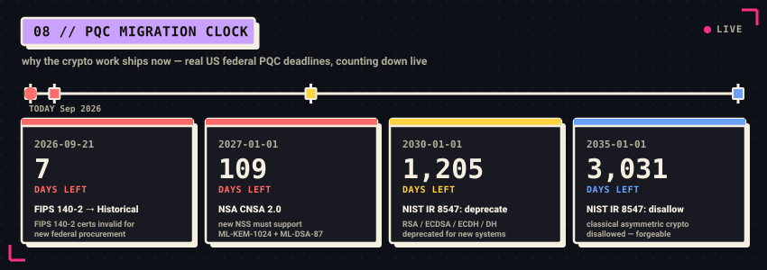
</picture>

</div>

---

## ▌ LANGUAGE MIX

<div align="center">

<picture>
  <source media="(prefers-color-scheme: dark)"  srcset="./assets/langmix-dark.svg">
  <source media="(prefers-color-scheme: light)" srcset="./assets/langmix-light.svg">
  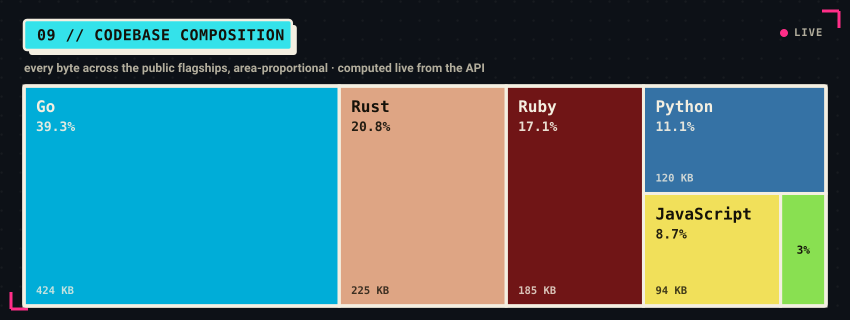
</picture>

</div>

> Go, Rust, TypeScript, Python and Ruby across the flagships — plus C, R, Java and Solidity further back in the arc. The language follows the problem: Rust where a sandbox boundary has to hold, Go for single-binary tooling, Ruby where the ecosystem gap was (a pure-Ruby ML-KEM did not exist), Python for anything touching data.

---

## ▌ AGENT-SECURITY STACK

<div align="center">

<picture>
  <source media="(prefers-color-scheme: dark)"  srcset="./assets/stack-dark.svg">
  <source media="(prefers-color-scheme: light)" srcset="./assets/stack-light.svg">
  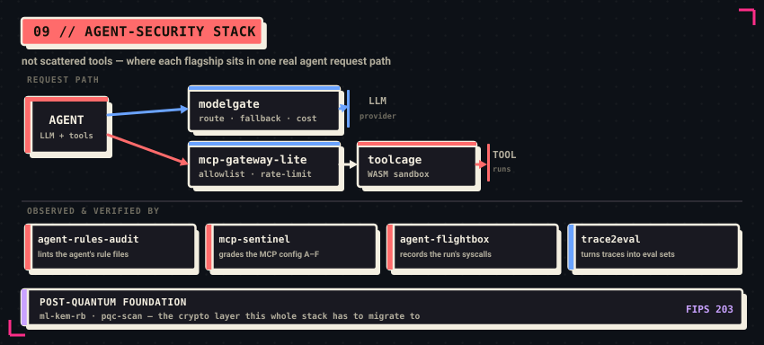
</picture>

</div>

> These aren't scattered side-projects. **The Ideal Harness** is the control plane the whole path runs through; `modelgate` gates the LLM calls; `mcp-gateway-lite` filters the tool calls; `toolcage` sandboxes each one; `mcp-sentinel`, `agent-rules-audit`, `agent-flightbox` and `trace2eval` watch the run — and `ml-kem-rb` / `pqc-scan` are the post-quantum floor the whole thing has to stand on.

---

## ▌ PORTFOLIO CONSTELLATION

<div align="center">

<picture>
  <source media="(prefers-color-scheme: dark)"  srcset="./assets/network-dark.svg">
  <source media="(prefers-color-scheme: light)" srcset="./assets/network-light.svg">
  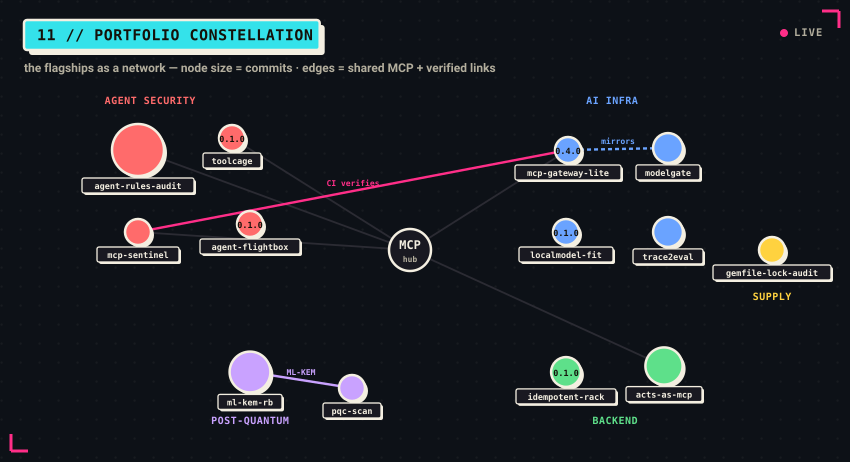
</picture>

</div>

> Node size is real commit count. The `MCP` hub links the repos that actually speak the protocol; the bright edge is the CI cross-check where **mcp-gateway-lite** verifies **mcp-sentinel**'s own lockfile output — a real test, not a diagram flourish.

---

## ▌ CONTRIBUTION GRAPH

<div align="center">

<picture>
  <source media="(prefers-color-scheme: dark)"  srcset="https://raw.githubusercontent.com/bharat3645/bharat3645/output/github-contribution-grid-snake-dark.svg">
  <source media="(prefers-color-scheme: light)" srcset="https://raw.githubusercontent.com/bharat3645/bharat3645/output/github-contribution-grid-snake.svg">
  
</picture>

</div>

---

<div align="center">

```
── EOF ────────────────────────────────────────────────────────────
   if a tool makes a claim, it ships with the test that proves it.
────────────────────────────────────────────────────────────────────
```

**This whole page is a program.** Twelve custom SVG instruments, built from live GitHub data by [`assets/generate.py`](./assets/generate.py), committed to this repo, and refreshed every day by a [GitHub Action](./.github/workflows/profile-assets.yml) — plus the classic animated contribution snake, regenerated daily from real commit data by its own long-running [GitHub Action](./.github/workflows/main.yml) and committed to this repo's `output` branch. No flaky Vercel-hosted widget services. No mocked numbers. Every figure is real and reproducible — down to the red build I haven't hidden.

<sub>◆ self-hosted ◆ live-sourced ◆ dark/light aware ◆ animated ◆ zero third-party image hosts</sub>

</div>
